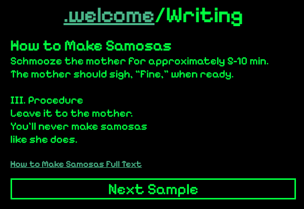

# portfolio

## technologies used
<ul>
<li>HTML</li>
<li>CSS</li>
<li>JavaScript</li>
</ul>

## installation instructions
The repo can be installed with the following command:  
`git clone https://github.com/opatel0/portfolio.git`

## user stories
As Jud's future employer, I want a quick and convenient way to observe his technical expertise, creativity, and previous work experience so that I can evaluate his fit for a job.

## app usage
The repo has two separate UIs for navigation

### mobile interface

### pc interface

## hurdles
Struggled with developing responsiveness and mobile UI features without proper planning/wireframing

## next steps
Implement CSS transitions and animations to improve UX